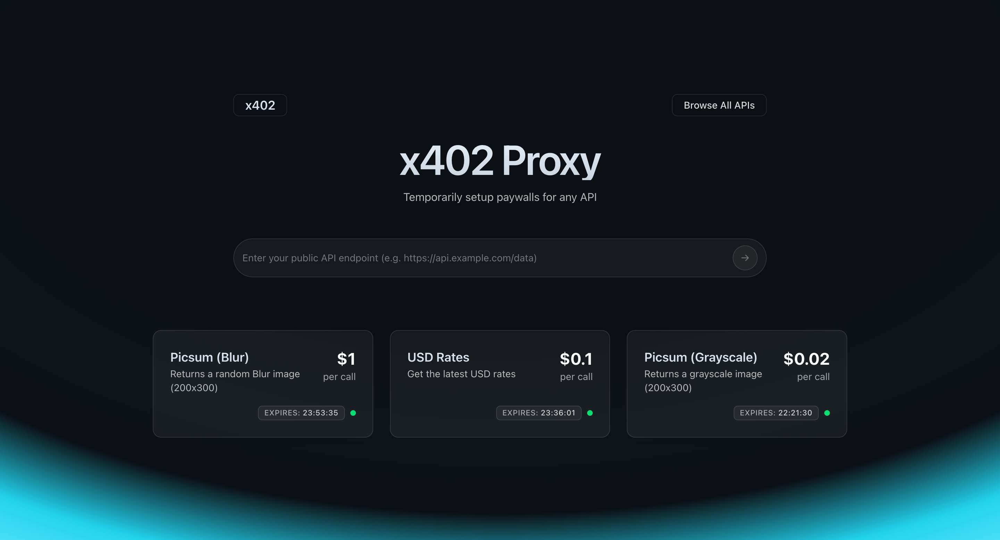

# x402 Proxy | Demo

This serves as a demo for testing out endpoints by adding an x402 enabled paywall


<hr/>


A full-stack Next.js application for managing crypto payments and invoices using Coinbase's infrastructure.

## Prerequisites

- Git
- Node.js (v22 or higher)
- Upstash 

## Environment Variables

Create a `.env` file in the root directory and fill in the variables:
```sh
mv .example.env .env
```

## Getting Started

1. Clone the repository:
```sh
git clone https://github.com/heimlabs/coinbase-x402-proxy.git
cd coinbase-x402-proxy
```

2. Install dependencies:
```sh
pnpm install
```

3. Set up your environment variables as described above.

4. Start the development server:
```sh
pnpm dev
```

The application will be available at [http://localhost:3000](http://localhost:3000).

## Building for Production

```sh
pnpm build
```

To start the production server:
```sh
pnpm start
```

## Contributing

1. Fork the repository
2. Create your feature branch (`git checkout -b feature/amazing-feature`)
3. Commit your changes (`git commit -m 'Add some amazing feature'`)
4. Push to the branch (`git push origin feature/amazing-feature`)
5. Open a Pull Request
